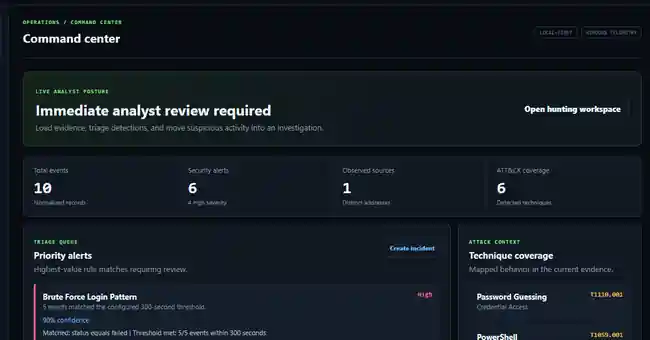

# SentinelOps

SentinelOps is a local-first Windows security log analyzer and SOC dashboard.
This repository keeps the original project and the upgraded Phase 6 edition as
two clearly separated applications.

## Choose A Version

| Version | Purpose | Run | Address |
| --- | --- | --- | --- |
| [SentinelOps v1.0](v1.0/README.md) | Original security log analyzer and SOC dashboard | `.\start-v1.ps1` | http://127.0.0.1:8080 |
| [SentinelOps v2.0](v2.0/README.md) | Modular Phase 6 threat hunting and incident platform | `start-v2.cmd` | http://127.0.0.1:8082 |

## SentinelOps v1.0

The original application analyzes real Windows event logs, detects common attack
patterns, maps findings to MITRE ATT&CK, calculates risk, and stores history
locally.


[Open the v1.0 documentation](v1.0/README.md)

## SentinelOps v2.0 Phase 6

The upgraded application adds a modular Python backend, expanded Windows and
Sysmon detections, incident case management, evidence-grounded AI summaries,
threat hunting, local IOC matching, Sigma import, an ATT&CK heatmap,
investigation timelines, and HTML/PDF reports.


### Detailed Dashboard View



[Open the v2.0 documentation](v2.0/README.md)

## Repository Layout

```text
SentinelOps/
|-- v1.0/          Original stable application
|-- v2.0/          Latest Phase 6 application
|-- assets/        Repository images
|-- start-v1.ps1   v1.0 launcher
`-- start-v2.ps1   v2.0 launcher
```

## Requirements

- Windows 10 or Windows 11
- PowerShell 5.1 or newer
- Python 3.10 or newer

If PowerShell blocks a launcher, allow scripts only for the current terminal:

```powershell
Set-ExecutionPolicy -Scope Process Bypass
```

The applications bind to `127.0.0.1`, and their SQLite databases stay on the
local computer. Do not publish databases or logs collected from real systems,
because they may contain sensitive information.

## License

SentinelOps source code is available under the [MIT License](LICENSE).
