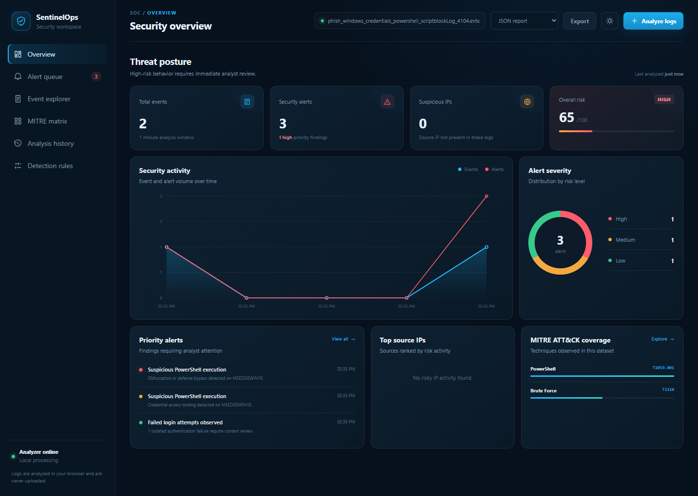

# SentinelOps v1.0

This folder contains the original stable SentinelOps security log analyzer and
SOC dashboard.



## Features

- Analyze Windows EVTX, JSON, JSONL, CSV, LOG, and TXT files
- Collect live Windows Security, System, Application, PowerShell, Defender, and Sysmon events
- Detect failed logins, brute force, password spraying, suspicious PowerShell, and privilege activity
- Correlate authentication, execution, and privilege events
- Map findings to MITRE ATT&CK
- Calculate Low, Medium, and High risk scores
- Store local analysis history in SQLite
- Export JSON, CSV, printable HTML, and PDF-ready reports

## Run v1.0

From the repository's main folder:

```powershell
.\start-v1.ps1
```

Or from this folder:

```powershell
.\start.ps1
```

Open http://127.0.0.1:8080 and stop the service with `Ctrl+C`.

No external Python packages are required. EVTX parsing, live collection,
checkpoints, and history require the local Python service.

## Real Test Logs

The [test log guide](test-logs/README.md) lists public EVTX samples verified
with SentinelOps. EVTX files are excluded from Git because they are third-party
data and may be large.

## Privacy

The service listens only on the local loopback interface. Log data and analysis
history remain on the local computer. Never publish `sentinelops.db` or logs
collected from a real organization.
