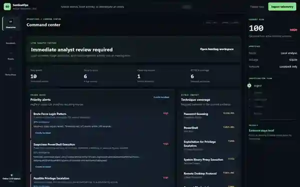

# SentinelOps v2.0 Phase 6

This is the clean Phase 6 build of SentinelOps v2.0. It is separated from later
experimental work so the detection-engine version can be developed, tested, and
published on its own.

## Phase 1 Foundation

- [x] Modular Python backend
- [x] Versioned `/api/v2` endpoints
- [x] Environment-based configuration
- [x] JSON structured logging
- [x] Ordered SQLite migrations
- [x] Consistent validation and API errors
- [x] ES-module frontend
- [x] Python and JavaScript tests

## Phase 2 Detection Engine

- [x] Sigma-inspired JSON detection rules
- [x] Built-in and custom rule persistence
- [x] Rule enable, disable, update, delete, and JSON import
- [x] Configurable event counts and time windows
- [x] User, host, source IP, and process allowlists
- [x] Duplicate alert suppression
- [x] Confidence scoring and match explanations
- [x] Severity and threshold overrides
- [x] In-browser rule test bench

## Phase 3 Windows And Sysmon Coverage

- [x] Expanded built-in rule pack from 4 rules to 15 rules
- [x] Sysmon process creation detections for LOLBins and suspicious parent-child chains
- [x] Sysmon network connection detections for scripting tools making outbound traffic
- [x] Sysmon registry autorun persistence detections
- [x] Sysmon suspicious file-drop detections in user-writable folders
- [x] Defender tamper and security-control modification detections
- [x] Security log clear, service installation, account manipulation, and RDP logon detections
- [x] Additional normalized fields for parent process, logon type, destination, registry, file, service, and hash data

## Phase 4 Incident Workflow

- [x] Create incidents from real detection alerts
- [x] Store incidents locally in SQLite
- [x] Track status: New, Investigating, Contained, Resolved, and False Positive
- [x] Track severity, owner, source, alert ID, rule ID, MITRE ID, and risk score
- [x] Add analyst investigation notes
- [x] Maintain a case timeline for creation, updates, and notes
- [x] Filter the incident queue by status
- [x] Open incident details from the SOC dashboard

## Phase 5 AI Incident Summary Engine

- [x] Generate executive and technical incident summaries
- [x] Explain suspicious behaviour using only saved alert and event evidence
- [x] Report only MITRE ATT&CK mappings already present in the evidence
- [x] Explain the stored risk level without inventing additional risk
- [x] Recommend investigation and conditional containment actions
- [x] Display evidence limitations and an evidence fingerprint
- [x] Save summary history in SQLite
- [x] Support correlated incidents containing multiple alerts and events
- [x] Optional OpenAI Responses API with strict Structured Outputs
- [x] Local evidence-only mode when no API key is configured

## Phase 6 Threat Hunting And Detection Expansion

- [x] Six built-in threat hunting queries
- [x] Local IOC lists for IPs, domains, hashes, usernames, and file paths
- [x] IOC matching against loaded event data
- [x] Simple Sigma JSON/YAML conversion into SentinelOps rules
- [x] MITRE ATT&CK frequency heatmap
- [x] Chronological incident investigation timeline
- [x] Local HTML and PDF incident report export
- [x] SQLite hunt history and IOC persistence

## Screenshots

These screenshots use safe synthetic telemetry created only to demonstrate the
workflow. SentinelOps does not ship with sample findings and analyzes logs supplied
by the user.

### Analyst Workbench



## AI Configuration

The default mode does not send data outside the computer. To enable OpenAI summaries
for the current PowerShell session:

```powershell
$env:OPENAI_API_KEY = "your-api-key"
$env:SENTINELOPS_OPENAI_MODEL = "gpt-5.5"
.\start.ps1
```

Never commit an API key or place one in the frontend. When cloud mode is enabled, the
app sends a restricted evidence packet containing allowlisted incident, alert, and event
fields. API requests use `store: false`.

## Run

```powershell
..\start-v2.cmd
```

Open `http://127.0.0.1:8082`.

Port `8082` is used so this folder can run beside other SentinelOps builds.

## Test

```powershell
.\test.ps1
```

## Structure

```text
v2.0/
|-- backend/
|   |-- api.py
|   |-- app.py
|   |-- config.py
|   |-- database.py
|   |-- rules.py
|   |-- server.py
|   |-- validation.py
|   |-- windows.py
|   `-- migrations/
|-- frontend/
|   |-- js/
|   |-- styles/
|   `-- index.html
|-- rules/
|-- tests/
|-- start.ps1
`-- test.ps1
```

See [docs/architecture.md](docs/architecture.md) for module responsibilities and
[docs/detection-rules.md](docs/detection-rules.md) for the rule schema.
